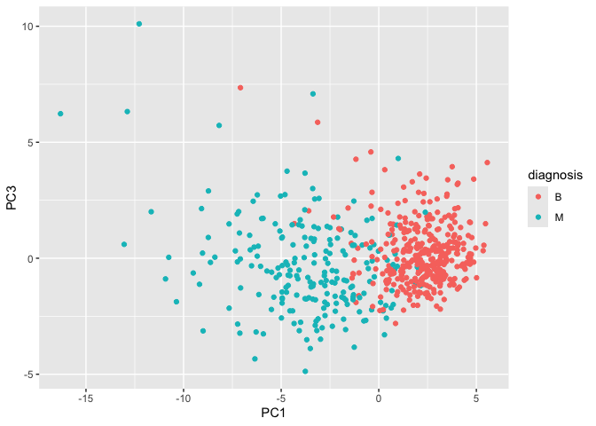
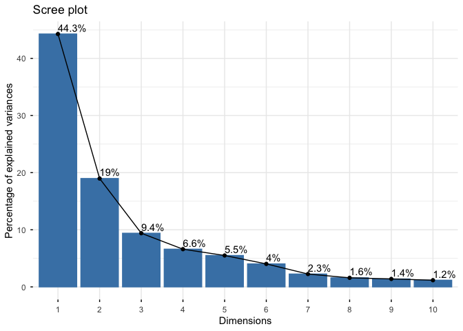

# Class 08: Breast Cancer Mini Project
Nathalie Huang (PID: A19134713)

- [Background](#background)
- [Data Import](#data-import)
- [Principal Component Analysis
  (PCA)](#principal-component-analysis-pca)
- [Variance explained](#variance-explained)
- [Hierarchical clustering](#hierarchical-clustering)
- [Combining methods](#combining-methods)
- [Prediction](#prediction)

## Background

In today’s class we will be employing all the R techniques for data and
analysis that we have learned thus far - including the machine learning
methods of clustering and PCA - to analyze real breast cancer biopsy
data.

## Data Import

The data is in CSV format:

``` r
wisc.df <- read.csv("WisconsinCancer.csv", row.names = 1)
```

wee peek at the data

``` r
head(wisc.df, 3)
```

             diagnosis radius_mean texture_mean perimeter_mean area_mean
    842302           M       17.99        10.38          122.8      1001
    842517           M       20.57        17.77          132.9      1326
    84300903         M       19.69        21.25          130.0      1203
             smoothness_mean compactness_mean concavity_mean concave.points_mean
    842302           0.11840          0.27760         0.3001             0.14710
    842517           0.08474          0.07864         0.0869             0.07017
    84300903         0.10960          0.15990         0.1974             0.12790
             symmetry_mean fractal_dimension_mean radius_se texture_se perimeter_se
    842302          0.2419                0.07871    1.0950     0.9053        8.589
    842517          0.1812                0.05667    0.5435     0.7339        3.398
    84300903        0.2069                0.05999    0.7456     0.7869        4.585
             area_se smoothness_se compactness_se concavity_se concave.points_se
    842302    153.40      0.006399        0.04904      0.05373           0.01587
    842517     74.08      0.005225        0.01308      0.01860           0.01340
    84300903   94.03      0.006150        0.04006      0.03832           0.02058
             symmetry_se fractal_dimension_se radius_worst texture_worst
    842302       0.03003             0.006193        25.38         17.33
    842517       0.01389             0.003532        24.99         23.41
    84300903     0.02250             0.004571        23.57         25.53
             perimeter_worst area_worst smoothness_worst compactness_worst
    842302             184.6       2019           0.1622            0.6656
    842517             158.8       1956           0.1238            0.1866
    84300903           152.5       1709           0.1444            0.4245
             concavity_worst concave.points_worst symmetry_worst
    842302            0.7119               0.2654         0.4601
    842517            0.2416               0.1860         0.2750
    84300903          0.4504               0.2430         0.3613
             fractal_dimension_worst
    842302                   0.11890
    842517                   0.08902
    84300903                 0.08758

> Q1. How many observations are in this dataset?

``` r
nrow(wisc.df)
```

    [1] 569

> Q2. How many of the observations have a malignant diagnosis?

``` r
table(wisc.df$diagnosis)
```


      B   M 
    357 212 

> Q3. How many variables/features in the data are suffixed with \_mean?

``` r
length(grep("_mean", colnames(wisc.df)))
```

    [1] 10

We need to remove the `diagnosis` column before we do any further
analysis of this dataset - we don’t want to pass this to PCA etc. We
will save it as a separate wee vector that we can use later to compare
our findings to those of experts…

``` r
wisc.data <- wisc.df[,-1]
diagnosis <- wisc.df$diagnosis
```

## Principal Component Analysis (PCA)

The main function in base R is called `prcomp()` we will use the
optional argument `scale=TRUE` here as the data
columns/features/dimensions are very different scales in the original
data set.

``` r
wisc.pr <- prcomp(wisc.data, scale=T)
```

``` r
attributes(wisc.pr)
```

    $names
    [1] "sdev"     "rotation" "center"   "scale"    "x"       

    $class
    [1] "prcomp"

``` r
summary(wisc.pr)
```

    Importance of components:
                              PC1    PC2     PC3     PC4     PC5     PC6     PC7
    Standard deviation     3.6444 2.3857 1.67867 1.40735 1.28403 1.09880 0.82172
    Proportion of Variance 0.4427 0.1897 0.09393 0.06602 0.05496 0.04025 0.02251
    Cumulative Proportion  0.4427 0.6324 0.72636 0.79239 0.84734 0.88759 0.91010
                               PC8    PC9    PC10   PC11    PC12    PC13    PC14
    Standard deviation     0.69037 0.6457 0.59219 0.5421 0.51104 0.49128 0.39624
    Proportion of Variance 0.01589 0.0139 0.01169 0.0098 0.00871 0.00805 0.00523
    Cumulative Proportion  0.92598 0.9399 0.95157 0.9614 0.97007 0.97812 0.98335
                              PC15    PC16    PC17    PC18    PC19    PC20   PC21
    Standard deviation     0.30681 0.28260 0.24372 0.22939 0.22244 0.17652 0.1731
    Proportion of Variance 0.00314 0.00266 0.00198 0.00175 0.00165 0.00104 0.0010
    Cumulative Proportion  0.98649 0.98915 0.99113 0.99288 0.99453 0.99557 0.9966
                              PC22    PC23   PC24    PC25    PC26    PC27    PC28
    Standard deviation     0.16565 0.15602 0.1344 0.12442 0.09043 0.08307 0.03987
    Proportion of Variance 0.00091 0.00081 0.0006 0.00052 0.00027 0.00023 0.00005
    Cumulative Proportion  0.99749 0.99830 0.9989 0.99942 0.99969 0.99992 0.99997
                              PC29    PC30
    Standard deviation     0.02736 0.01153
    Proportion of Variance 0.00002 0.00000
    Cumulative Proportion  1.00000 1.00000

> Q4. From your results, what proportion of the original variance is
> captured by the first principal component (PC1)?

0.4427 = 44.27%

> Q5. How many principal components (PCs) are required to describe at
> least 70% of the original variance in the data?

3 principal components

> Q6. How many principal components (PCs) are required to describe at
> least 90% of the original variance in the data?

7 principal components

``` r
biplot(wisc.pr)
```


> Q7. What stands out to you about this plot? Is it easy or difficult to
> understand? Why?

The biplot is very cluttered and difficult to interpret. With so many
observations and variables, the points and variable arrows overlap
heavily, making it hard to see patterns or understand how variables
contribute to the principal components.

``` r
library(ggplot2)

ggplot(wisc.pr$x) +
  aes(PC1, PC2, col=diagnosis) +
  geom_point()
```


> Q8. Generate a similar plot for principal components 1 and 3. What do
> you notice about these plots?

``` r
ggplot(wisc.pr$x) +
  aes(PC1, PC3, col=diagnosis) +
  geom_point()
```



## Variance explained

``` r
pr.var <- wisc.pr$sdev^2
head(pr.var)
```

    [1] 13.281608  5.691355  2.817949  1.980640  1.648731  1.207357

``` r
pve <- pr.var / sum(pr.var)
```

``` r
plot(c(1, pve), 
     xlab = "Principal Component", 
     ylab = "Proportion of Variance Explained", 
     ylim = c(0, 1), 
     type = "o")
```


``` r
barplot(pve, 
        ylab = "Percent of Variance Explained",
        names.arg = paste0("PC", 1:length(pve)), 
        las = 2, 
        axes = FALSE)
axis(2, at = pve, labels = round(pve, 2) * 100)
```


\#install.packages(“factoextra”)

``` r
library(factoextra)
```

    Welcome! Want to learn more? See two factoextra-related books at https://goo.gl/ve3WBa

``` r
fviz_eig(wisc.pr, addlabels = TRUE)
```

    Warning in geom_bar(stat = "identity", fill = barfill, color = barcolor, :
    Ignoring empty aesthetic: `width`.



> Q9. For the first principal component, what is the component of the
> loading vector (i.e. wisc.pr\$rotation\[,1\]) for the feature
> concave.points_mean? This tells us how much this original feature
> contributes to the first PC. Are there any features with larger
> contributions than this one?

``` r
wisc.pr$rotation
```

                                    PC1          PC2          PC3          PC4
    radius_mean             -0.21890244  0.233857132 -0.008531243  0.041408962
    texture_mean            -0.10372458  0.059706088  0.064549903 -0.603050001
    perimeter_mean          -0.22753729  0.215181361 -0.009314220  0.041983099
    area_mean               -0.22099499  0.231076711  0.028699526  0.053433795
    smoothness_mean         -0.14258969 -0.186113023 -0.104291904  0.159382765
    compactness_mean        -0.23928535 -0.151891610 -0.074091571  0.031794581
    concavity_mean          -0.25840048 -0.060165363  0.002733838  0.019122753
    concave.points_mean     -0.26085376  0.034767500 -0.025563541  0.065335944
    symmetry_mean           -0.13816696 -0.190348770 -0.040239936  0.067124984
    fractal_dimension_mean  -0.06436335 -0.366575471 -0.022574090  0.048586765
    radius_se               -0.20597878  0.105552152  0.268481387  0.097941242
    texture_se              -0.01742803 -0.089979682  0.374633665 -0.359855528
    perimeter_se            -0.21132592  0.089457234  0.266645367  0.088992415
    area_se                 -0.20286964  0.152292628  0.216006528  0.108205039
    smoothness_se           -0.01453145 -0.204430453  0.308838979  0.044664180
    compactness_se          -0.17039345 -0.232715896  0.154779718 -0.027469363
    concavity_se            -0.15358979 -0.197207283  0.176463743  0.001316880
    concave.points_se       -0.18341740 -0.130321560  0.224657567  0.074067335
    symmetry_se             -0.04249842 -0.183848000  0.288584292  0.044073351
    fractal_dimension_se    -0.10256832 -0.280092027  0.211503764  0.015304750
    radius_worst            -0.22799663  0.219866379 -0.047506990  0.015417240
    texture_worst           -0.10446933  0.045467298 -0.042297823 -0.632807885
    perimeter_worst         -0.23663968  0.199878428 -0.048546508  0.013802794
    area_worst              -0.22487053  0.219351858 -0.011902318  0.025894749
    smoothness_worst        -0.12795256 -0.172304352 -0.259797613  0.017652216
    compactness_worst       -0.21009588 -0.143593173 -0.236075625 -0.091328415
    concavity_worst         -0.22876753 -0.097964114 -0.173057335 -0.073951180
    concave.points_worst    -0.25088597  0.008257235 -0.170344076  0.006006996
    symmetry_worst          -0.12290456 -0.141883349 -0.271312642 -0.036250695
    fractal_dimension_worst -0.13178394 -0.275339469 -0.232791313 -0.077053470
                                     PC5           PC6           PC7          PC8
    radius_mean             -0.037786354  0.0187407904 -0.1240883403  0.007452296
    texture_mean             0.049468850 -0.0321788366  0.0113995382 -0.130674825
    perimeter_mean          -0.037374663  0.0173084449 -0.1144770573  0.018687258
    area_mean               -0.010331251 -0.0018877480 -0.0516534275 -0.034673604
    smoothness_mean          0.365088528 -0.2863744966 -0.1406689928  0.288974575
    compactness_mean        -0.011703971 -0.0141309489  0.0309184960  0.151396350
    concavity_mean          -0.086375412 -0.0093441809 -0.1075204434  0.072827285
    concave.points_mean      0.043861025 -0.0520499505 -0.1504822142  0.152322414
    symmetry_mean            0.305941428  0.3564584607 -0.0938911345  0.231530989
    fractal_dimension_mean   0.044424360 -0.1194306679  0.2957600240  0.177121441
    radius_se                0.154456496 -0.0256032561  0.3124900373 -0.022539967
    texture_se               0.191650506 -0.0287473145 -0.0907553556  0.475413139
    perimeter_se             0.120990220  0.0018107150  0.3146403902  0.011896690
    area_se                  0.127574432 -0.0428639079  0.3466790028 -0.085805135
    smoothness_se            0.232065676 -0.3429173935 -0.2440240556 -0.573410232
    compactness_se          -0.279968156  0.0691975186  0.0234635340 -0.117460157
    concavity_se            -0.353982091  0.0563432386 -0.2088237897 -0.060566501
    concave.points_se       -0.195548089 -0.0312244482 -0.3696459369  0.108319309
    symmetry_se              0.252868765  0.4902456426 -0.0803822539 -0.220149279
    fractal_dimension_se    -0.263297438 -0.0531952674  0.1913949726 -0.011168188
    radius_worst             0.004406592 -0.0002906849 -0.0097099360 -0.042619416
    texture_worst            0.092883400 -0.0500080613  0.0098707439 -0.036251636
    perimeter_worst         -0.007454151  0.0085009872 -0.0004457267 -0.030558534
    area_worst               0.027390903 -0.0251643821  0.0678316595 -0.079394246
    smoothness_worst         0.324435445 -0.3692553703 -0.1088308865 -0.205852191
    compactness_worst       -0.121804107  0.0477057929  0.1404729381 -0.084019659
    concavity_worst         -0.188518727  0.0283792555 -0.0604880561 -0.072467871
    concave.points_worst    -0.043332069 -0.0308734498 -0.1679666187  0.036170795
    symmetry_worst           0.244558663  0.4989267845 -0.0184906298 -0.228225053
    fractal_dimension_worst -0.094423351 -0.0802235245  0.3746576261 -0.048360667
                                     PC9         PC10        PC11         PC12
    radius_mean             -0.223109764  0.095486443 -0.04147149  0.051067457
    texture_mean             0.112699390  0.240934066  0.30224340  0.254896423
    perimeter_mean          -0.223739213  0.086385615 -0.01678264  0.038926106
    area_mean               -0.195586014  0.074956489 -0.11016964  0.065437508
    smoothness_mean          0.006424722 -0.069292681  0.13702184  0.316727211
    compactness_mean        -0.167841425  0.012936200  0.30800963 -0.104017044
    concavity_mean           0.040591006 -0.135602298 -0.12419024  0.065653480
    concave.points_mean     -0.111971106  0.008054528  0.07244603  0.042589267
    symmetry_mean            0.256040084  0.572069479 -0.16305408 -0.288865504
    fractal_dimension_mean  -0.123740789  0.081103207  0.03804827  0.236358988
    radius_se                0.249985002 -0.049547594  0.02535702 -0.016687915
    texture_se              -0.246645397 -0.289142742 -0.34494446 -0.306160423
    perimeter_se             0.227154024 -0.114508236  0.16731877 -0.101446828
    area_se                  0.229160015 -0.091927889 -0.05161946 -0.017679218
    smoothness_se           -0.141924890  0.160884609 -0.08420621 -0.294710053
    compactness_se          -0.145322810  0.043504866  0.20688568 -0.263456509
    concavity_se             0.358107079 -0.141276243 -0.34951794  0.251146975
    concave.points_se        0.272519886  0.086240847  0.34237591 -0.006458751
    symmetry_se             -0.304077200 -0.316529830  0.18784404  0.320571348
    fractal_dimension_se    -0.213722716  0.367541918 -0.25062479  0.276165974
    radius_worst            -0.112141463  0.077361643 -0.10506733  0.039679665
    texture_worst            0.103341204  0.029550941 -0.01315727  0.079797450
    perimeter_worst         -0.109614364  0.050508334 -0.05107628 -0.008987738
    area_worst              -0.080732461  0.069921152 -0.18459894  0.048088657
    smoothness_worst         0.112315904 -0.128304659 -0.14389035  0.056514866
    compactness_worst       -0.100677822 -0.172133632  0.19742047 -0.371662503
    concavity_worst          0.161908621 -0.311638520 -0.18501676 -0.087034532
    concave.points_worst     0.060488462 -0.076648291  0.11777205 -0.068125354
    symmetry_worst           0.064637806 -0.029563075 -0.15756025  0.044033503
    fractal_dimension_worst -0.134174175  0.012609579 -0.11828355 -0.034731693
                                   PC13         PC14         PC15        PC16
    radius_mean              0.01196721  0.059506135 -0.051118775 -0.15058388
    texture_mean             0.20346133 -0.021560100 -0.107922421 -0.15784196
    perimeter_mean           0.04410950  0.048513812 -0.039902936 -0.11445396
    area_mean                0.06737574  0.010830829  0.013966907 -0.13244803
    smoothness_mean          0.04557360  0.445064860 -0.118143364 -0.20461325
    compactness_mean         0.22928130  0.008101057  0.230899962  0.17017837
    concavity_mean           0.38709081 -0.189358699 -0.128283732  0.26947021
    concave.points_mean      0.13213810 -0.244794768 -0.217099194  0.38046410
    symmetry_mean            0.18993367  0.030738856 -0.073961707 -0.16466159
    fractal_dimension_mean   0.10623908 -0.377078865  0.517975705 -0.04079279
    radius_se               -0.06819523  0.010347413 -0.110050711  0.05890572
    texture_se              -0.16822238 -0.010849347  0.032752721 -0.03450040
    perimeter_se            -0.03784399 -0.045523718 -0.008268089  0.02651665
    area_se                  0.05606493  0.083570718 -0.046024366  0.04115323
    smoothness_se            0.15044143 -0.201152530  0.018559465 -0.05803906
    compactness_se           0.01004017  0.491755932  0.168209315  0.18983090
    concavity_se             0.15878319  0.134586924  0.250471408 -0.12542065
    concave.points_se       -0.49402674 -0.199666719  0.062079344 -0.19881035
    symmetry_se              0.01033274 -0.046864383 -0.113383199 -0.15771150
    fractal_dimension_se    -0.24045832  0.145652466 -0.353232211  0.26855388
    radius_worst            -0.13789053  0.023101281  0.166567074 -0.08156057
    texture_worst           -0.08014543  0.053430792  0.101115399  0.18555785
    perimeter_worst         -0.09696571  0.012219382  0.182755198 -0.05485705
    area_worst              -0.10116061 -0.006685465  0.314993600 -0.09065339
    smoothness_worst        -0.20513034  0.162235443  0.046125866  0.14555166
    compactness_worst        0.01227931  0.166470250 -0.049956014 -0.15373486
    concavity_worst          0.21798433 -0.066798931 -0.204835886 -0.21502195
    concave.points_worst    -0.25438749 -0.276418891 -0.169499607  0.17814174
    symmetry_worst          -0.25653491  0.005355574  0.139888394  0.25789401
    fractal_dimension_worst -0.17281424 -0.212104110 -0.256173195 -0.40555649
                                    PC17          PC18        PC19         PC20
    radius_mean              0.202924255  0.1467123385  0.22538466 -0.049698664
    texture_mean            -0.038706119 -0.0411029851  0.02978864 -0.244134993
    perimeter_mean           0.194821310  0.1583174548  0.23959528 -0.017665012
    area_mean                0.255705763  0.2661681046 -0.02732219 -0.090143762
    smoothness_mean          0.167929914 -0.3522268017 -0.16456584  0.017100960
    compactness_mean        -0.020307708  0.0077941384  0.28422236  0.488686329
    concavity_mean          -0.001598353 -0.0269681105  0.00226636 -0.033387086
    concave.points_mean      0.034509509 -0.0828277367 -0.15497236 -0.235407606
    symmetry_mean           -0.191737848  0.1733977905 -0.05881116  0.026069156
    fractal_dimension_mean   0.050225246  0.0878673570 -0.05815705 -0.175637222
    radius_se               -0.139396866 -0.2362165319  0.17588331 -0.090800503
    texture_se               0.043963016 -0.0098586620  0.03600985 -0.071659988
    perimeter_se            -0.024635639 -0.0259288003  0.36570154 -0.177250625
    area_se                  0.334418173  0.3049069032 -0.41657231  0.274201148
    smoothness_se            0.139595006 -0.2312599432 -0.01326009  0.090061477
    compactness_se          -0.008246477  0.1004742346 -0.24244818 -0.461098220
    concavity_se             0.084616716 -0.0001954852  0.12638102  0.066946174
    concave.points_se        0.108132263  0.0460549116 -0.01216430  0.068868294
    symmetry_se             -0.274059129  0.1870147640 -0.08903929  0.107385289
    fractal_dimension_se    -0.122733398 -0.0598230982  0.08660084  0.222345297
    radius_worst            -0.240049982 -0.2161013526  0.01366130 -0.005626909
    texture_worst            0.069365185  0.0583984505 -0.07586693  0.300599798
    perimeter_worst         -0.234164147 -0.1885435919  0.09081325  0.011003858
    area_worst              -0.273399584 -0.1420648558 -0.41004720  0.060047387
    smoothness_worst        -0.278030197  0.5015516751  0.23451384 -0.129723903
    compactness_worst       -0.004037123 -0.0735745143  0.02020070  0.229280589
    concavity_worst         -0.191313419 -0.1039079796 -0.04578612 -0.046482792
    concave.points_worst    -0.075485316  0.0758138963 -0.26022962  0.033022340
    symmetry_worst           0.430658116 -0.2787138431  0.11725053 -0.116759236
    fractal_dimension_worst  0.159394300  0.0235647497 -0.01149448 -0.104991974
                                     PC21        PC22          PC23        PC24
    radius_mean             -0.0685700057 -0.07292890 -0.0985526942 -0.18257944
    texture_mean             0.4483694667 -0.09480063 -0.0005549975  0.09878679
    perimeter_mean          -0.0697690429 -0.07516048 -0.0402447050 -0.11664888
    area_mean               -0.0184432785 -0.09756578  0.0077772734  0.06984834
    smoothness_mean         -0.1194917473 -0.06382295 -0.0206657211  0.06869742
    compactness_mean         0.1926213963  0.09807756  0.0523603957 -0.10413552
    concavity_mean           0.0055717533  0.18521200  0.3248703785  0.04474106
    concave.points_mean     -0.0094238187  0.31185243 -0.0514087968  0.08402770
    symmetry_mean           -0.0869384844  0.01840673 -0.0512005770  0.01933947
    fractal_dimension_mean  -0.0762718362 -0.28786888 -0.0846898562 -0.13326055
    radius_se                0.0863867747  0.15027468 -0.2641253170 -0.55870157
    texture_se               0.2170719674 -0.04845693 -0.0008738805  0.02426730
    perimeter_se            -0.3049501584 -0.15935280  0.0900742110  0.51675039
    area_se                  0.1925877857 -0.06423262  0.0982150746 -0.02246072
    smoothness_se           -0.0720987261 -0.05054490 -0.0598177179  0.01563119
    compactness_se          -0.1403865724  0.04528769  0.0091038710 -0.12177779
    concavity_se             0.0630479298  0.20521269 -0.3875423290  0.18820504
    concave.points_se        0.0343753236  0.07254538  0.3517550738 -0.10966898
    symmetry_se             -0.0976995265  0.08465443 -0.0423628949  0.00322620
    fractal_dimension_se     0.0628432814 -0.24470508  0.0857810992  0.07519442
    radius_worst             0.0072938995  0.09629821 -0.0556767923 -0.15683037
    texture_worst           -0.5944401434  0.11111202 -0.0089228997 -0.11848460
    perimeter_worst         -0.0920235990 -0.01722163  0.0633448296  0.23711317
    area_worst               0.1467901315  0.09695982  0.1908896250  0.14406303
    smoothness_worst         0.1648492374  0.06825409  0.0936901494 -0.01099014
    compactness_worst        0.1813748671 -0.02967641 -0.1479209247  0.18674995
    concavity_worst         -0.1321005945 -0.46042619  0.2864331353 -0.28885257
    concave.points_worst     0.0008860815 -0.29984056 -0.5675277966  0.10734024
    symmetry_worst           0.1627085487 -0.09714484  0.1213434508 -0.01438181
    fractal_dimension_worst -0.0923439434  0.46947115  0.0076253382  0.03782545
                                   PC25         PC26         PC27          PC28
    radius_mean             -0.01922650 -0.129476396 -0.131526670  2.111940e-01
    texture_mean             0.08474593 -0.024556664 -0.017357309 -6.581146e-05
    perimeter_mean           0.02701541 -0.125255946 -0.115415423  8.433827e-02
    area_mean               -0.21004078  0.362727403  0.466612477 -2.725083e-01
    smoothness_mean          0.02895489 -0.037003686  0.069689923  1.479269e-03
    compactness_mean         0.39662323  0.262808474  0.097748705 -5.462767e-03
    concavity_mean          -0.09697732 -0.548876170  0.364808397  4.553864e-02
    concave.points_mean     -0.18645160  0.387643377 -0.454699351 -8.883097e-03
    symmetry_mean           -0.02458369 -0.016044038 -0.015164835  1.433026e-03
    fractal_dimension_mean  -0.20722186 -0.097404839 -0.101244946 -6.311687e-03
    radius_se               -0.17493043  0.049977080  0.212982901 -1.922239e-01
    texture_se               0.05698648 -0.011237242 -0.010092889 -5.622611e-03
    perimeter_se             0.07292764  0.103653282  0.041691553  2.631919e-01
    area_se                  0.13185041 -0.155304589 -0.313358657 -4.206811e-02
    smoothness_se            0.03121070 -0.007717557 -0.009052154  9.792963e-03
    compactness_se           0.17316455 -0.049727632  0.046536088 -1.539555e-02
    concavity_se             0.01593998  0.091454968 -0.084224797  5.820978e-03
    concave.points_se       -0.12954655 -0.017941919 -0.011165509 -2.900930e-02
    symmetry_se             -0.01951493 -0.017267849 -0.019975983 -7.636526e-03
    fractal_dimension_se    -0.08417120  0.035488974 -0.012036564  1.975646e-02
    radius_worst             0.07070972 -0.197054744 -0.178666740  4.126396e-01
    texture_worst           -0.11818972  0.036469433  0.021410694 -3.902509e-04
    perimeter_worst          0.11803403 -0.244103670 -0.241031046 -7.286809e-01
    area_worst              -0.03828995  0.231359525  0.237162466  2.389603e-01
    smoothness_worst        -0.04796476  0.012602464 -0.040853568 -1.535248e-03
    compactness_worst       -0.62438494 -0.100463424 -0.070505414  4.869182e-02
    concavity_worst          0.11577034  0.266853781 -0.142905801 -1.764090e-02
    concave.points_worst     0.26319634 -0.133574507  0.230901389  2.247567e-02
    symmetry_worst           0.04529962  0.028184296  0.022790444  4.920481e-03
    fractal_dimension_worst  0.28013348  0.004520482  0.059985998 -2.356214e-02
                                     PC29          PC30
    radius_mean              2.114605e-01  0.7024140910
    texture_mean            -1.053393e-02  0.0002736610
    perimeter_mean           3.838261e-01 -0.6898969685
    area_mean               -4.227949e-01 -0.0329473482
    smoothness_mean         -3.434667e-03 -0.0048474577
    compactness_mean        -4.101677e-02  0.0446741863
    concavity_mean          -1.001479e-02  0.0251386661
    concave.points_mean     -4.206949e-03 -0.0010772653
    symmetry_mean           -7.569862e-03 -0.0012803794
    fractal_dimension_mean   7.301433e-03 -0.0047556848
    radius_se                1.184421e-01 -0.0087110937
    texture_se              -8.776279e-03 -0.0010710392
    perimeter_se            -6.100219e-03  0.0137293906
    area_se                 -8.592591e-02  0.0011053260
    smoothness_se            1.776386e-03 -0.0016082109
    compactness_se           3.158134e-03  0.0019156224
    concavity_se             1.607852e-02 -0.0089265265
    concave.points_se       -2.393779e-02 -0.0021601973
    symmetry_se             -5.223292e-03  0.0003293898
    fractal_dimension_se    -8.341912e-03  0.0017989568
    radius_worst            -6.357249e-01 -0.1356430561
    texture_worst            1.723549e-02  0.0010205360
    perimeter_worst          2.292180e-02  0.0797438536
    area_worst               4.449359e-01  0.0397422838
    smoothness_worst         7.385492e-03  0.0045832773
    compactness_worst        3.566904e-06 -0.0128415624
    concavity_worst         -1.267572e-02  0.0004021392
    concave.points_worst     3.524045e-02 -0.0022884418
    symmetry_worst           1.340423e-02  0.0003954435
    fractal_dimension_worst  1.147766e-02  0.0018942925

The loading for concave.points_mean on the first principal component is
relatively large and positive, showing that this feature contributes
strongly to PC1. While a few other features like concavity_mean,
area_mean, and perimeter_mean have similarly large loadings, none
contribute substantially more than concave.points_mean. This indicates
that PC1 is mainly influenced by tumor shape and size features.

## Hierarchical clustering

The goal of this section is to do hierarchical clustering of the
original datato see if there is any obvious grouping into malignant and
benign clusters.

In short, these results are not good!

First we will scale our `wisc.data` then calculate a distance matrix,
then pass to `hclust()`:

``` r
data.scaled <- scale(wisc.data)
data.dist <- dist(data.scaled)
wisc.hclust <- hclust(data.dist, method = "complete")
```

> Q10. Using the plot() and abline() functions, what is the height at
> which the clustering model has 4 clusters?

``` r
plot(wisc.hclust)
abline(h = 15, col = "red", lty = 2)
```


``` r
wisc.hclust.clusters <- cutree(wisc.hclust, k = 4)
```

``` r
table(wisc.hclust.clusters, diagnosis)
```

                        diagnosis
    wisc.hclust.clusters   B   M
                       1  12 165
                       2   2   5
                       3 343  40
                       4   0   2

> Q12. Which method gives your favorite results for the same data.dist
> dataset? Explain your reasoning.

My favorite method for this dataset is ward.D2, because it creates more
compact clusters and minimizes variance within each cluster. It
separates malignant and benign samples better than single, complete, or
average linkage, producing clusters that correspond more closely to the
diagnosis.

## Combining methods

The idea here is that I can take my new variable (i.e. the scores on the
PCs `wisc.pr$x`) that are better descriptors of the data-set than the
original features (i.e. the 30 columns in `wisc.data`) and use these as
a basis for clustering.

``` r
pc.dist <- dist(wisc.pr$x[,1:3])
wisc.pr.hclust <- hclust(pc.dist, method= "ward.D2")
plot(wisc.pr.hclust)
```


``` r
grps <- cutree(wisc.pr.hclust, k=2)
table(grps)
```

    grps
      1   2 
    203 366 

``` r
table(diagnosis)
```

    diagnosis
      B   M 
    357 212 

I can now run `table()` with both my clustering `grps` and the expert
`diagnosis`

``` r
table(grps, diagnosis)
```

        diagnosis
    grps   B   M
       1  24 179
       2 333  33

> Q13. How well does the newly created hclust model with two clusters
> separate out the two “M” and “B” diagnoses?

``` r
wisc.pr.hclust.clusters <- cutree(wisc.pr.hclust, k = 2)

table(wisc.pr.hclust.clusters, diagnosis)
```

                           diagnosis
    wisc.pr.hclust.clusters   B   M
                          1  24 179
                          2 333  33

> Q14. How well do the hierarchical clustering models you created in the
> previous sections (i.e. without first doing PCA) do in terms of
> separating the diagnoses? Again, use the table() function to compare
> the output of each model (wisc.hclust.clusters and
> wisc.pr.hclust.clusters) with the vector containing the actual
> diagnoses.

``` r
wisc.hclust.clusters <- cutree(wisc.hclust, k = 4)

table(wisc.hclust.clusters, diagnosis)
```

                        diagnosis
    wisc.hclust.clusters   B   M
                       1  12 165
                       2   2   5
                       3 343  40
                       4   0   2

Our cluster “1” has 179 “M” diagnosis or cluster “2” has 333 “B”
diagnosis

179 TP 24 FP 333 TN 33 FN

Sensitity: TP/(TP+FN)

``` r
179/(179+33)
```

    [1] 0.8443396

Specificity: TN/(TN+FP)

``` r
333/(333 + 24)
```

    [1] 0.9327731

``` r
ggplot(wisc.pr$x) +
  aes(PC1, PC2) +
  geom_point(col=grps)
```


## Prediction

We can use our PCA model for prediction of new un-seen cases:

``` r
url <- "https://tinyurl.com/new-samples-CSV"
new <- read.csv(url)
npc <- predict(wisc.pr, newdata=new)
npc
```

               PC1       PC2        PC3        PC4       PC5        PC6        PC7
    [1,]  2.576616 -3.135913  1.3990492 -0.7631950  2.781648 -0.8150185 -0.3959098
    [2,] -4.754928 -3.009033 -0.1660946 -0.6052952 -1.140698 -1.2189945  0.8193031
                PC8       PC9       PC10      PC11      PC12      PC13     PC14
    [1,] -0.2307350 0.1029569 -0.9272861 0.3411457  0.375921 0.1610764 1.187882
    [2,] -0.3307423 0.5281896 -0.4855301 0.7173233 -1.185917 0.5893856 0.303029
              PC15       PC16        PC17        PC18        PC19       PC20
    [1,] 0.3216974 -0.1743616 -0.07875393 -0.11207028 -0.08802955 -0.2495216
    [2,] 0.1299153  0.1448061 -0.40509706  0.06565549  0.25591230 -0.4289500
               PC21       PC22       PC23       PC24        PC25         PC26
    [1,]  0.1228233 0.09358453 0.08347651  0.1223396  0.02124121  0.078884581
    [2,] -0.1224776 0.01732146 0.06316631 -0.2338618 -0.20755948 -0.009833238
                 PC27        PC28         PC29         PC30
    [1,]  0.220199544 -0.02946023 -0.015620933  0.005269029
    [2,] -0.001134152  0.09638361  0.002795349 -0.019015820

``` r
plot(wisc.pr$x[,1:2], col=grps)
points(npc[,1], npc[,2], col="blue", pch=16, cex=3)
text(npc[,1], npc[,2], c(1,2), col="white")
```


> Q16. Which of these new patients should we prioritize for follow up
> based on your results?

New patients assigned to cluster 1 are most likely malignant based on
the PCA + hierarchical clustering model.
