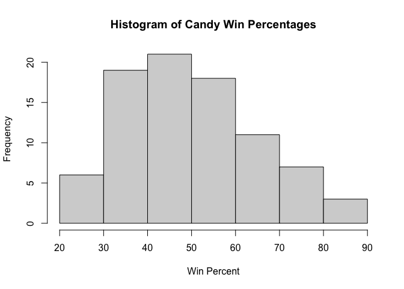
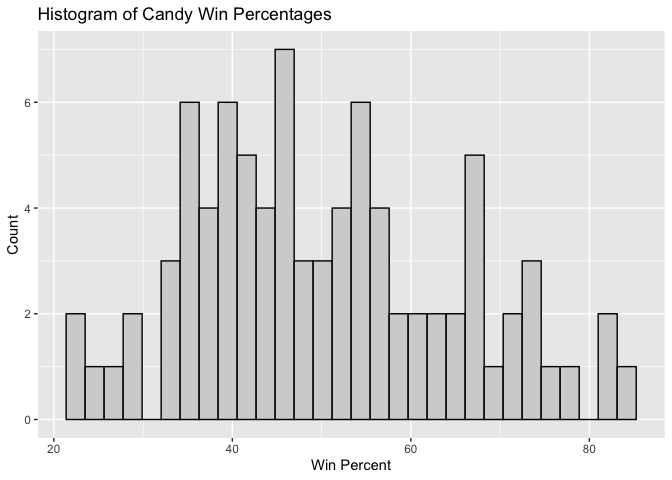
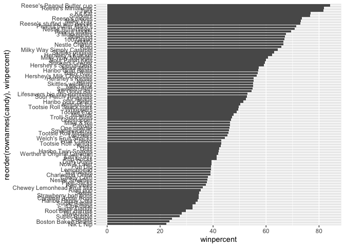
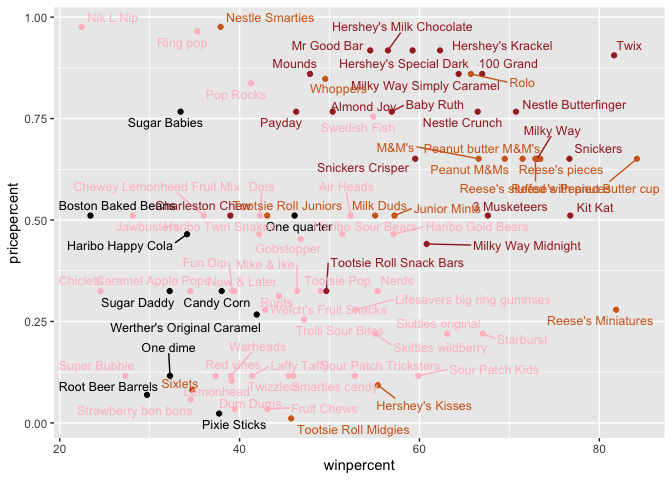
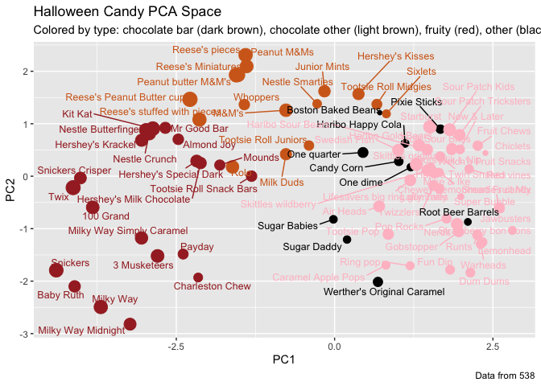
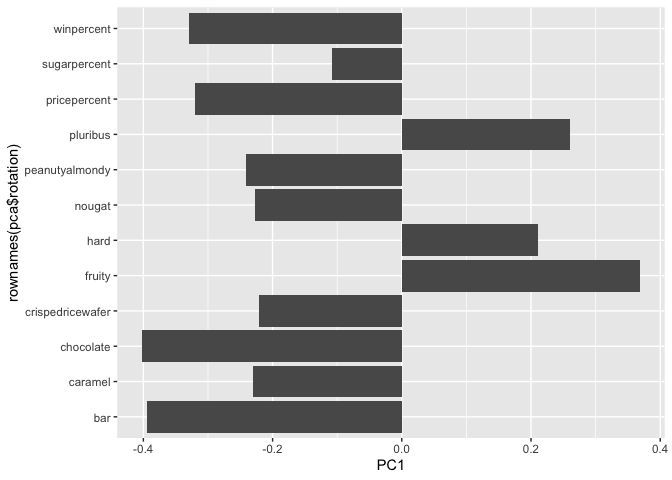
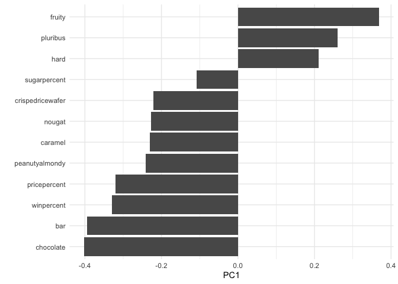

# Class 9: Candy Mini-Project
Nathalie Huang (PID: A19134713)

- [Importing candy data](#importing-candy-data)
- [Exploratory analysis](#exploratory-analysis)
- [Overall Candy Rankings](#overall-candy-rankings)
- [Taking a look at pricepercent](#taking-a-look-at-pricepercent)
- [Exploring the correlation
  structure](#exploring-the-correlation-structure)
- [Principal Component Analysis](#principal-component-analysis)
- [Make a new data-frame with our PCA results and candy
  data](#make-a-new-data-frame-with-our-pca-results-and-candy-data)
  - [Summary](#summary)

## Importing candy data

``` r
candy_file <- "candy-data.csv"
candy <- read.csv(candy_file, row.names = 1)
head(candy)
```

                 chocolate fruity caramel peanutyalmondy nougat crispedricewafer
    100 Grand            1      0       1              0      0                1
    3 Musketeers         1      0       0              0      1                0
    One dime             0      0       0              0      0                0
    One quarter          0      0       0              0      0                0
    Air Heads            0      1       0              0      0                0
    Almond Joy           1      0       0              1      0                0
                 hard bar pluribus sugarpercent pricepercent winpercent
    100 Grand       0   1        0        0.732        0.860   66.97173
    3 Musketeers    0   1        0        0.604        0.511   67.60294
    One dime        0   0        0        0.011        0.116   32.26109
    One quarter     0   0        0        0.011        0.511   46.11650
    Air Heads       0   0        0        0.906        0.511   52.34146
    Almond Joy      0   1        0        0.465        0.767   50.34755

> Q1. How many different candy types are in this dataset?

There are 85 rows in this dataset

``` r
nrow(candy)
```

    [1] 85

> Q2. How many fruity candy types are in the dataset?

``` r
sum(candy$fruity)
```

    [1] 38

One of the most interesting variables in the dataset is winpercent. For
a given candy this value is the percentage of people who prefer this
candy over another randomly chosen candy from the dataset. Higher values
indicate a more popular candy.

``` r
candy["Twix", ]$winpercent
```

    [1] 81.64291

``` r
library(dplyr)
```


    Attaching package: 'dplyr'

    The following objects are masked from 'package:stats':

        filter, lag

    The following objects are masked from 'package:base':

        intersect, setdiff, setequal, union

``` r
candy |> 
  filter(row.names(candy)=="Twix") |> 
  select(winpercent)
```

         winpercent
    Twix   81.64291

> Q3. What is your favorite candy (other than Twix) in the dataset and
> what is it’s winpercent value?

``` r
candy["Sour Patch Kids", ]$winpercent
```

    [1] 59.864

> Q4. What is the winpercent value for “Kit Kat”?

``` r
candy["Kit Kat", ]$winpercent
```

    [1] 76.7686

> Q5. What is the winpercent value for “Tootsie Roll Snack Bars”?

``` r
candy["Tootsie Roll Snack Bars", ]$winpercent
```

    [1] 49.6535

There is a useful skim() function in the skimr package that can help
give you a quick overview of a given dataset.

\#install skimr package \#install.packages(“skimr”)

``` r
library("skimr")
skim(candy)
```

|                                                  |       |
|:-------------------------------------------------|:------|
| Name                                             | candy |
| Number of rows                                   | 85    |
| Number of columns                                | 12    |
| \_\_\_\_\_\_\_\_\_\_\_\_\_\_\_\_\_\_\_\_\_\_\_   |       |
| Column type frequency:                           |       |
| numeric                                          | 12    |
| \_\_\_\_\_\_\_\_\_\_\_\_\_\_\_\_\_\_\_\_\_\_\_\_ |       |
| Group variables                                  | None  |

Data summary

**Variable type: numeric**

| skim_variable | n_missing | complete_rate | mean | sd | p0 | p25 | p50 | p75 | p100 | hist |
|:---|---:|---:|---:|---:|---:|---:|---:|---:|---:|:---|
| chocolate | 0 | 1 | 0.44 | 0.50 | 0.00 | 0.00 | 0.00 | 1.00 | 1.00 | ▇▁▁▁▆ |
| fruity | 0 | 1 | 0.45 | 0.50 | 0.00 | 0.00 | 0.00 | 1.00 | 1.00 | ▇▁▁▁▆ |
| caramel | 0 | 1 | 0.16 | 0.37 | 0.00 | 0.00 | 0.00 | 0.00 | 1.00 | ▇▁▁▁▂ |
| peanutyalmondy | 0 | 1 | 0.16 | 0.37 | 0.00 | 0.00 | 0.00 | 0.00 | 1.00 | ▇▁▁▁▂ |
| nougat | 0 | 1 | 0.08 | 0.28 | 0.00 | 0.00 | 0.00 | 0.00 | 1.00 | ▇▁▁▁▁ |
| crispedricewafer | 0 | 1 | 0.08 | 0.28 | 0.00 | 0.00 | 0.00 | 0.00 | 1.00 | ▇▁▁▁▁ |
| hard | 0 | 1 | 0.18 | 0.38 | 0.00 | 0.00 | 0.00 | 0.00 | 1.00 | ▇▁▁▁▂ |
| bar | 0 | 1 | 0.25 | 0.43 | 0.00 | 0.00 | 0.00 | 0.00 | 1.00 | ▇▁▁▁▂ |
| pluribus | 0 | 1 | 0.52 | 0.50 | 0.00 | 0.00 | 1.00 | 1.00 | 1.00 | ▇▁▁▁▇ |
| sugarpercent | 0 | 1 | 0.48 | 0.28 | 0.01 | 0.22 | 0.47 | 0.73 | 0.99 | ▇▇▇▇▆ |
| pricepercent | 0 | 1 | 0.47 | 0.29 | 0.01 | 0.26 | 0.47 | 0.65 | 0.98 | ▇▇▇▇▆ |
| winpercent | 0 | 1 | 50.32 | 14.71 | 22.45 | 39.14 | 47.83 | 59.86 | 84.18 | ▃▇▆▅▂ |

> Q6. Is there any variable/column that looks to be on a different scale
> to the majority of the other columns in the dataset?

Most variables in the candy dataset are measured on a zero to one scale,
either as binary indicators or proportions. However, the variable
winpercent appears to be on a different scale compared to the majority
of the dataset. Unlike the other columns, winpercent ranges from
approximately 0 to 100 and represents the percentage of people who
prefer each candy.

> Q7. What do you think a zero and one represent for the
> candy\$chocolate column?

The chocolate column is a binary variable that only takes values of zero
or one. A value of one indicates that the candy contains chocolate,
while a value of zero indicates that it does not. It tells us whether
chocolate is an ingredient in the candy.

## Exploratory analysis

> Q8. Plot a histogram of winpercent values using both base R an
> ggplot2.

``` r
hist(candy$winpercent,
     main = "Histogram of Candy Win Percentages",
     xlab = "Win Percent")
```



``` r
library(ggplot2)

ggplot(candy, aes(x = winpercent)) +
  geom_histogram(color="black", fill="lightgray") +
  labs(title = "Histogram of Candy Win Percentages",
       x = "Win Percent",
       y = "Count")
```

    `stat_bin()` using `bins = 30`. Pick better value `binwidth`.



> Q9. Is the distribution of winpercent values symmetrical?

The distribution of winpercent values does not appear to be symmetrical.
While the data are somewhat centered around the middle range, the
histogram shows a slight skew. This suggests a mild right skew rather
than a symmetric, bell-shaped distribution. This means that most candies
have lower winpercent values, and only a smaller number of candies have
very high winpercent values.

> Q10. Is the center of the distribution above or below 50%?

The center of the distribution is below 50%.

Welch Two Sample t-test

``` r
chocolate <- candy$winpercent[as.logical(candy$chocolate)]
fruity <- candy$winpercent[as.logical(candy$fruity)]

t.test(chocolate, fruity)
```


        Welch Two Sample t-test

    data:  chocolate and fruity
    t = 6.2582, df = 68.882, p-value = 2.871e-08
    alternative hypothesis: true difference in means is not equal to 0
    95 percent confidence interval:
     11.44563 22.15795
    sample estimates:
    mean of x mean of y 
     60.92153  44.11974 

> Q11. On average is chocolate candy higher or lower ranked than fruit
> candy?

Steps to solve this: 1. Find all chocolate candy in the dataset 2.
Extract or find their winpercent values 3. Calculate the mean of these
values 4. Find all fruit candy 5. Find their winpercent values 6.
Calculate their mean value

``` r
choc.candy <- candy[candy$chocolate==1, ]
choc.win <- choc.candy$winpercent
mean(choc.win)
```

    [1] 60.92153

``` r
fruity.candy <- candy[candy$fruity==1, ]
fruity.win <- fruity.candy$winpercent
mean(fruity.win)
```

    [1] 44.11974

The mean winpercent for chocolate candies is approximately 60.9%,
whereas the mean for fruity candies is about 44.1%. This indicates that
chocolate candies are generally more preferred than fruity candies in
this dataset.

> Q12. Is this difference statistically significant?

Yes, the difference is statistically significant. The Welch two-sample
t-test comparing chocolate and fruity candies produced a p-value below
the conventional significance threshold of 0.05. Additionally, the 95%
confidence interval for the difference in means does not include zero,
providing evidence that chocolate candies are significantly more popular
than fruity candies on average.

## Overall Candy Rankings

> Q13. What are the five least liked candy types in this set?

``` r
head(candy[order(candy$winpercent), ], n = 5)
```

                       chocolate fruity caramel peanutyalmondy nougat
    Nik L Nip                  0      1       0              0      0
    Boston Baked Beans         0      0       0              1      0
    Chiclets                   0      1       0              0      0
    Super Bubble               0      1       0              0      0
    Jawbusters                 0      1       0              0      0
                       crispedricewafer hard bar pluribus sugarpercent pricepercent
    Nik L Nip                         0    0   0        1        0.197        0.976
    Boston Baked Beans                0    0   0        1        0.313        0.511
    Chiclets                          0    0   0        1        0.046        0.325
    Super Bubble                      0    0   0        0        0.162        0.116
    Jawbusters                        0    1   0        1        0.093        0.511
                       winpercent
    Nik L Nip            22.44534
    Boston Baked Beans   23.41782
    Chiclets             24.52499
    Super Bubble         27.30386
    Jawbusters           28.12744

> Q14. What are the top 5 all time favorite candy types out of this set?

``` r
head(candy[order(-candy$winpercent), ], n = 5)
```

                              chocolate fruity caramel peanutyalmondy nougat
    Reese's Peanut Butter cup         1      0       0              1      0
    Reese's Miniatures                1      0       0              1      0
    Twix                              1      0       1              0      0
    Kit Kat                           1      0       0              0      0
    Snickers                          1      0       1              1      1
                              crispedricewafer hard bar pluribus sugarpercent
    Reese's Peanut Butter cup                0    0   0        0        0.720
    Reese's Miniatures                       0    0   0        0        0.034
    Twix                                     1    0   1        0        0.546
    Kit Kat                                  1    0   1        0        0.313
    Snickers                                 0    0   1        0        0.546
                              pricepercent winpercent
    Reese's Peanut Butter cup        0.651   84.18029
    Reese's Miniatures               0.279   81.86626
    Twix                             0.906   81.64291
    Kit Kat                          0.511   76.76860
    Snickers                         0.651   76.67378

> Q15. Make a first barplot of candy ranking based on winpercent values.

``` r
library(ggplot2)

ggplot(candy) +
  aes(winpercent, rownames(candy)) +
  geom_col()
```


> Q16. This is quite ugly, use the reorder() function to get the bars
> sorted by winpercent?

``` r
library(ggplot2)

ggplot(candy) +
  aes(winpercent, reorder(rownames(candy),winpercent)) +
  geom_col()
```



We start by making a vector of all black values (one for each candy).
Then we overwrite chocolate (for chocolate candy), brown (for candy
bars) and red (for fruity candy) values.

``` r
my_cols=rep("black", nrow(candy))
my_cols[as.logical(candy$chocolate)] = "chocolate"
my_cols[as.logical(candy$bar)] = "brown"
my_cols[as.logical(candy$fruity)] = "pink"
```

``` r
ggplot(candy) + 
  aes(winpercent, reorder(rownames(candy),winpercent)) +
  geom_col(fill=my_cols) 
```


> Q17. What is the worst ranked chocolate candy?

Sixlets

> Q18. What is the best ranked fruity candy?

Starburst

## Taking a look at pricepercent

``` r
library(ggrepel)

ggplot(candy) +
  aes(x = winpercent, y = pricepercent, label = rownames(candy)) +
  geom_point(col = my_cols) +
  geom_text_repel(col = my_cols, size = 3.3, max.overlaps = 100)
```



> Q19. Which candy type is the highest ranked in terms of winpercent for
> the least money - i.e. offers the most bang for your buck?

Based on the plot of winpercent versus pricepercent, Reese’s Miniatures
appear to offer the most bang for your buck. They have one of the
highest winpercent values while also having a relatively low
pricepercent.

> Q20. What are the top 5 most expensive candy types in the dataset and
> of these which is the least popular?

``` r
ord <- order(candy$pricepercent, decreasing = TRUE)
head( candy[ord,c(11,12)], n=5 )
```

                             pricepercent winpercent
    Nik L Nip                       0.976   22.44534
    Nestle Smarties                 0.976   37.88719
    Ring pop                        0.965   35.29076
    Hershey's Krackel               0.918   62.28448
    Hershey's Milk Chocolate        0.918   56.49050

The five most expensive candy types are Nik L Nip, Nestle Smarties, Ring
pop, Hershey’s Krackel, and Hershey’s Milk Chocolate. Among these
higher-priced candies, Nik L Nip is the least popular, as it has the
lowest winpercent of the group.

## Exploring the correlation structure

``` r
library(corrplot)
```

    corrplot 0.95 loaded

``` r
cij <- cor(candy)
corrplot(cij)
```


> Q22. Examining this plot what two variables are anti-correlated
> (i.e. have minus values)?

Chocolate and fruity are the most anti‑correlated pair. They are the
deepest red circle (towards -1).

> Q23. Similarly, what two variables are most positively correlated?

The variables chocolate and bar show a strong positive correlation,
since many chocolate candies are sold in bar form. In addition,
chocolate and winpercent are also positively correlated, as candies that
contain chocolate tend to have higher win percentages and are generally
more popular.

## Principal Component Analysis

``` r
pca <- prcomp(candy, scale = TRUE)
summary(pca)
```

    Importance of components:
                              PC1    PC2    PC3     PC4    PC5     PC6     PC7
    Standard deviation     2.0788 1.1378 1.1092 1.07533 0.9518 0.81923 0.81530
    Proportion of Variance 0.3601 0.1079 0.1025 0.09636 0.0755 0.05593 0.05539
    Cumulative Proportion  0.3601 0.4680 0.5705 0.66688 0.7424 0.79830 0.85369
                               PC8     PC9    PC10    PC11    PC12
    Standard deviation     0.74530 0.67824 0.62349 0.43974 0.39760
    Proportion of Variance 0.04629 0.03833 0.03239 0.01611 0.01317
    Cumulative Proportion  0.89998 0.93832 0.97071 0.98683 1.00000

``` r
plot(pca$x[, 1:2])
```


\#We can change the plotting character and add some color:

``` r
plot(pca$x[,1:2], col=my_cols, pch=16)
```


# Make a new data-frame with our PCA results and candy data

``` r
my_data <- cbind(candy, pca$x[,1:3])
```

``` r
p <- ggplot(my_data) + 
        aes(x = PC1, y = PC2, 
            size = winpercent / 100,  
            text = rownames(my_data),
            label = rownames(my_data)) +
        geom_point(col = my_cols)

p
```


Again we can use the ggrepel package and the function
ggrepel::geom_text_repel() to label up the plot with non overlapping
candy names like.

``` r
library(ggrepel)

p + geom_text_repel(size=3.3, col=my_cols, max.overlaps = 100)  + 
  theme(legend.position = "none") +
  labs(title="Halloween Candy PCA Space",
       subtitle="Colored by type: chocolate bar (dark brown), chocolate other (light brown), fruity (red), other (black)",
       caption="Data from 538")
```



\#install.packages(“plotly”)

\#\`\`\`{r} \#library(plotly) \#ggplotly(p)

``` r
ggplot(pca$rotation) +
  aes(x = PC1, y = rownames(pca$rotation)) +
  geom_col()
```



``` r
ggplot(pca$rotation) +
  aes(x = PC1, y = reorder(rownames(pca$rotation), PC1)) +
  geom_col() +
  labs(x = "PC1", y = "") +
  theme_minimal()
```



> Q24. Complete the code to generate the loadings plot above. What
> original variables are picked up strongly by PC1 in the positive
> direction? Do these make sense to you? Where did you see this
> relationship highlighted previously?

The variables most strongly associated with the positive direction of
PC1 are fruity, pluribus, and hard. This makes sense because these
features tend to co‑occur in non‑chocolate, sugar‑based candies, which
often come as multiple small pieces and have a harder texture. PC1 is
capturing a contrast between fruity candies and chocolate candies. We
saw this same relationship earlier in the correlation matrix, where
fruity and chocolate were strongly anti‑correlated, and chocolate and
bar were positively correlated.

## Summary

> Q25. Based on your exploratory analysis, correlation findings, and PCA
> results, what combination of characteristics appears to make a
> “winning” candy? How do these different analyses (visualization,
> correlation, PCA) support or complement each other in reaching this
> conclusion?

The candies that tend to “win” are those with classic chocolate bar
characteristics. Chocolate candies consistently showed higher winpercent
values than fruity candies, and the correlation analysis highlighted
strong positive relationships between chocolate and other bar‑like
traits such as caramel, nougat, and peanutyalmondy. These traits were
negatively correlated with fruity and hard‑candy features, suggesting a
clear divide between the two candy styles. The PCA results reinforced
this pattern by placing chocolate‑bar attributes together on one side of
PC1—along with winpercent—while fruity, pluribus, and hard candies
loaded strongly in the opposite direction.
